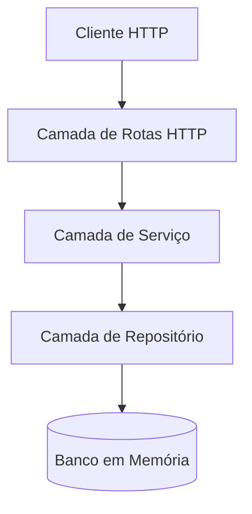

# Documentação de Arquitetura — AI-First Task Manager

> **Por que documentar a Arquitetura para a IA?**
> Ao solicitar a implementação de novos códigos, a IA tende a propor estruturas baseadas em suas bases de treino gerais (muitas vezes misturando estilos de arquitetura hexagonal, MVC, ou scripts monolíticos). A documentação arquitetural fornece as **diretrizes e padrões estruturais do projeto**. Ela garante que as novas implementações sigam a coerência da base de código existente, mantendo a consistência conceitual (ex: separando rotas de regras de serviço) e evitando acoplamentos indesejados.

---

## 1. Visão Geral e Decisões Técnicas

O projeto adota uma arquitetura em camadas simplificada, ideal para microserviços e APIs de pequeno/médio porte.

### Escolhas Tecnológicas
-   **Node.js (v20+):** Ambiente de execução Javascript leve e amplamente adotado.
-   **TypeScript:** Adiciona tipagem estática opcional, aumentando a segurança do código e facilitando o autocompletar da IA.
-   **Fastify:** Um framework web focado em alta performance e baixo overhead, com suporte excelente e nativo a TypeScript.
-   **Vitest:** Um executor de testes moderno e extremamente veloz que compartilha a mesma configuração de compilação do TypeScript.

---

## 2. Estrutura de Pastas

O repositório segue uma organização modularizada por contextos de negócio (módulos), mantendo o código relacionado agrupado.

```
src/
├── app.ts                  # Inicialização e configuração do Fastify (sem escutar porta)
├── server.ts               # Entrada da aplicação (escuta a porta HTTP e inicia o servidor)
└── modules/
    └── tasks/              # Módulo de Tarefas
        ├── task.types.ts       # Definições de tipos e interfaces do domínio
        ├── task.repository.ts  # Camada de acesso a dados (banco de dados em memória)
        ├── task.service.ts     # Camada lógica de aplicação e regras de negócio
        └── task.routes.ts      # Definições de endpoints HTTP e validações
```

---

## 3. Camadas da Aplicação e Responsabilidades



### 3.1 Camada de Rotas (`task.routes.ts`)
-   **Responsabilidade:** Receber requisições HTTP, validar payloads de entrada, invocar o serviço correspondente e retornar a resposta HTTP adequada com os códigos de status recomendados (e.g., 200, 201, 400, 404).
-   **O que não fazer:** Nunca colocar lógica de negócio ou manipulação de banco de dados diretamente nos handlers de rota.

### 3.2 Camada de Serviço (`task.service.ts`)
-   **Responsabilidade:** Conter as regras de negócio descritas no PRD e no DOMAIN.md. Orquestrar chamadas ao repositório para salvar ou recuperar dados.
-   **O que não fazer:** Não acessar requisições HTTP (`req`, `reply`) ou detalhes específicos de transporte de rede dentro dos serviços. Os serviços devem receber parâmetros limpos e lançar erros sem conhecimento da camada web.

### 3.3 Camada de Repositório (`task.repository.ts`)
-   **Responsabilidade:** Abstrair o acesso aos dados da aplicação. Gerencia o array em memória que simula nossa tabela de banco de dados.
-   **O que não fazer:** Conter regras de negócio (como validar se o título do produto está no formato correto). Apenas executa operações de leitura e escrita.

---

## 4. Fluxo de uma Requisição

Vamos examinar o fluxo típico de uma criação de tarefa (`POST /tasks`):
1. O **Cliente** envia uma requisição `POST /tasks` com o corpo `{ "title": "Estudar IA" }`.
2. A camada de **Rotas** valida se o payload tem os campos necessários. Se faltar o título, retorna `400 Bad Request`. Caso contrário, chama o método `createTask` do **Service**.
3. O **Service** valida se as regras do domínio (comprimento do título) são cumpridas. Se violado, lança um erro de negócio. Se estiver OK, monta o objeto completo da entidade `Task` e chama o **Repository**.
4. O **Repository** adiciona o objeto à estrutura de memória e o retorna.
5. O **Service** recebe a confirmação e repassa o objeto de volta à **Rota**.
6. A **Rota** responde com status `201 Created` e o corpo formatado em JSON.

---

## 5. Padrões Adotados (Guidelines de Código)

-   **Tratamento de Erros:** Usar exceções explícitas (classes de erro customizadas ou erros padrão do JavaScript) na camada de serviço. As rotas devem capturar esses erros em blocos `try/catch` (ou no manipulador global do Fastify) para mapear o erro ao status HTTP apropriado.
-   **Injeção de Dependências Manual:** O `TaskService` deve receber a instância de `TaskRepository` no seu construtor, facilitando a substituição por mocks durante a execução de testes.
-   **Clean Code:** Métodos curtos, com responsabilidade única e nomes descritivos.

---

## 6. O que Evitar
-   **Código Acoplado:** Não importe classes diretamente instanciadas se for possível injetá-las.
-   **Bibliotecas Externas no Domínio:** Manter a camada de tipos e lógica pura de dependências excessivas (por exemplo, frameworks de validação acoplados com tipos internos do domínio).
-   **Tipagem com `any`:** O uso de `any` desabilita os benefícios do TypeScript e prejudica a análise de contexto que a IA utiliza para sugerir código.

---

## 7. Evoluções Futuras
-   Substituição do banco de dados em memória por uma ferramenta ORM/Query Builder (ex: Prisma, Drizzle ORM) conectada a um banco PostgreSQL.
-   Implementação de filtros dinâmicos e paginação na rota de listagem de tarefas.
-   Adição de mecanismos de autenticação (JWT) e separação de tarefas por conta de usuário (`userId`).
