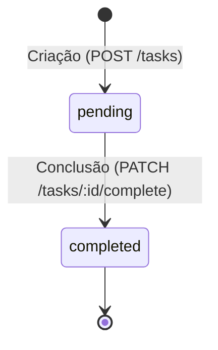

# Modelo de Domínio — AI-First Task Manager

> **Por que documentar o Domínio para a IA?**
> A IA não tem conhecimento inato sobre as regras específicas do seu negócio. Se você pedir para ela "criar uma regra para tarefas concluídas", sem um modelo de domínio explícito, ela pode inventar regras de outros sistemas que não se aplicam ao seu (como permitir deletar tarefas concluídas ou alterar o status para qualquer outra coisa arbitrária). Documentar as entidades, seus estados válidos e as regras de transição cria uma **fronteira semântica** rígida na qual a IA opera com extrema precisão.

---

## 1. Entidades do Sistema

### 1.1 Task (Tarefa)
É a entidade central do sistema. Representa uma atividade que precisa ser executada por um usuário.

| Campo | Tipo | Descrição | Restrições |
| :--- | :--- | :--- | :--- |
| `id` | UUID (string) | Identificador único da tarefa | Gerado automaticamente pelo sistema (v4). |
| `title` | String | Título curto e descritivo da tarefa | Obrigatório, 3 a 100 caracteres. |
| `description` | String / null | Explicação detalhada da atividade | Opcional. |
| `status` | Enum | Estado atual da tarefa | Pode ser `pending` ou `completed`. |
| `createdAt` | Date | Data e hora de criação da tarefa | Definido automaticamente na criação. |
| `updatedAt` | Date | Data e hora da última modificação | Atualizado a cada mudança na tarefa. |
| `completedAt` | Date / null | Data e hora em que a tarefa foi concluída | Preenchido apenas quando status transita para `completed`. |

### 1.2 User (Usuário — Simplificado para MVP)
Embora a autenticação esteja fora do escopo do MVP, modelamos a existência de um usuário fictício implícito para quem as tarefas pertencem. Em futuras iterações, a entidade `Task` conterá uma chave `userId`.

---

## 2. Máquina de Estados da Tarefa (Status Transitions)

Uma tarefa possui um ciclo de vida simples de estados. A mudança de estado deve seguir a seguinte lógica:

### Regras de Transição de Estado:
1.  **Criação:** Toda tarefa nasce no estado `pending`.
2.  **Conclusão:** Uma tarefa pode mudar de `pending` para `completed`.
3.  **Imutabilidade pós-conclusão:** Uma tarefa no estado `completed` entra em estado final de edição:
    - Não é permitido alterar o `title` ou `description` de uma tarefa com status `completed`.
    - Não é permitido alterar as datas de auditoria retroativamente de forma manual.

---

## 3. Casos de Uso (Use Cases)

### UC01 — Criar Tarefa
- **Atores:** Usuário do Sistema
- **Fluxo Principal:**
  1. O ator envia o título e a descrição opcional.
  2. O sistema valida se o título cumpre os requisitos de tamanho (3 a 100 caracteres).
  3. O sistema gera um ID único (UUIDv4) e define o status como `pending`.
  4. O sistema define `createdAt` e `updatedAt` como o timestamp atual.
  5. O sistema persiste a tarefa na memória e retorna os dados criados.

### UC02 — Listar Tarefas
- **Atores:** Usuário do Sistema
- **Fluxo Principal:**
  1. O ator solicita a listagem de tarefas.
  2. O sistema recupera todas as tarefas armazenadas em memória.
  3. O sistema retorna a lista de tarefas.
- **Fluxo Alternativo (Filtragem por Status):**
  1. O ator solicita a listagem passando um filtro de status (ex: `pending`).
  2. O sistema filtra e retorna apenas as tarefas que correspondem ao status fornecido.

### UC03 — Editar Detalhes da Tarefa
- **Atores:** Usuário do Sistema
- **Fluxo Principal:**
  1. O ator fornece o ID da tarefa e os novos campos (`title`, `description`).
  2. O sistema localiza a tarefa pelo ID. Se não encontrar, retorna erro de não encontrado.
  3. O sistema verifica se a tarefa está com o status `completed`. Se estiver, bloqueia a alteração retornando erro de regra de negócio (Tarefa Concluída não pode ser modificada).
  4. O sistema valida os novos dados.
  5. O sistema atualiza os campos e define o `updatedAt` com o timestamp atual.
  6. O sistema persiste as alterações e retorna a tarefa atualizada.

### UC04 — Concluir Tarefa
- **Atores:** Usuário do Sistema
- **Fluxo Principal:**
  1. O ator fornece o ID da tarefa que deseja concluir.
  2. O sistema localiza a tarefa pelo ID. Se não encontrar, retorna erro de não encontrado.
  3. O sistema altera o status da tarefa para `completed`.
  4. O sistema define as datas `updatedAt` e `completedAt` com o timestamp atual.
  5. O sistema persiste a alteração e retorna a tarefa atualizada.

---

## 4. Glossário do Domínio
*   **Task (Tarefa):** Unidade de trabalho que descreve uma ação pendente ou concluída.
*   **Pending (Pendente):** Estado inicial de uma tarefa que ainda não foi executada.
*   **Completed (Concluída):** Estado final de uma tarefa que foi realizada com sucesso pelo usuário.
*   **Audit Dates (Datas de Auditoria):** Campos que registram o histórico de tempo de vida do objeto no sistema (`createdAt`, `updatedAt`, `completedAt`).
*   **In-Memory Store (Armazenamento em Memória):** Estrutura volátil temporária (como um array ou mapa em Javascript/TypeScript) usada para simular persistência em banco de dados.
